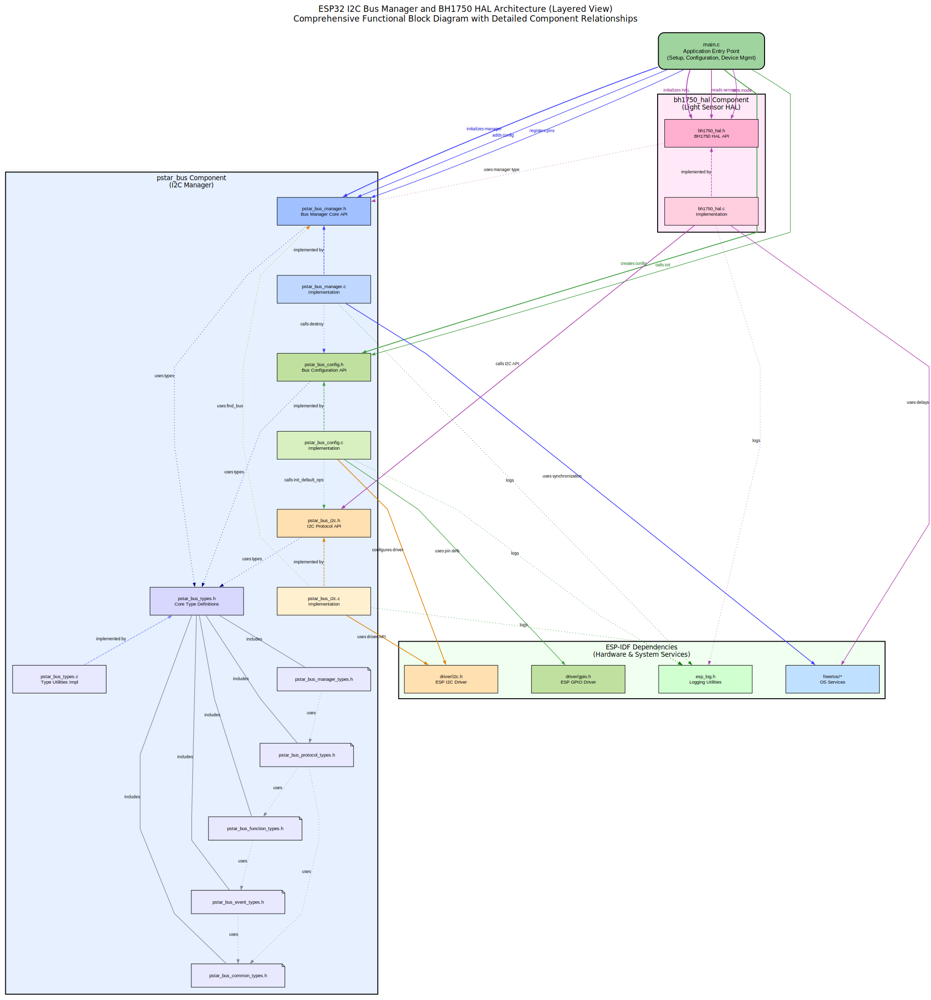

# Project-STAR: Survey and Terrain Analysis Robot (STAR)

[](https://topographic-robot.github.io/Project-STAR-Documentation/html/index.html)

**STAR (Survey and Terrain Analysis Robot)** is an advanced terrain-mapping robot designed to autonomously navigate and create detailed 3D mesh topology maps of various landscapes, including hills and valleys. This repository contains the firmware for the ESP32 microcontroller that powers STAR.

_(Note: This repository is under active development. While the goal is a fully autonomous mapping robot, the currently implemented features focus on the Hardware Abstraction Layers (HALs) and supporting utilities.)_

## Table of Contents

- [Project-STAR: Survey and Terrain Analysis Robot (STAR)](#project-star-survey-and-terrain-analysis-robot-star)
  - [Table of Contents](#table-of-contents)
  - [Currently Implemented Features](#currently-implemented-features)
  - [Supported Hardware Components](#supported-hardware-components)
  - [Software](#software)
    - [Architecture Diagram (Bus Manager)](#architecture-diagram-bus-manager)
    - [Dependencies](#dependencies)
  - [Installation](#installation)
  - [Configuration](#configuration)
    - [Using menuconfig](#using-menuconfig)
  - [Running Examples or Main Application](#running-examples-or-main-application)
  - [JTAG Debugging](#jtag-debugging)
  - [Contributing](#contributing)
  - [License](#license)

## Currently Implemented Features

This repository currently provides the following firmware features and utilities:

- **I2C Bus Management:** A manager (`pstar_bus`) to handle I2C bus configurations and operations.
- **SPI Bus Management:** Integrated into `pstar_bus` to handle SPI bus/device configurations and operations.
- **Ambient Light Sensing:** HAL (`pstar_bh1750_hal`) for the BH1750 I2C light sensor.
- **Temperature & Humidity Sensing:** HAL (`pstar_dht22_hal`) for the DHT22 sensor (using a custom 1-wire protocol).
- **Character LCD Display:** HAL (`pstar_hd44780_hal`) for HD44780-compatible LCDs (4-bit parallel or I2C mode).
- **Air Quality Sensing (Analog):** HAL (`pstar_mq135_hal`) for the MQ135 analog gas sensor using ESP32's ADC.
- **PWM/Servo Control:** HAL (`pstar_pca9685_hal`) for the PCA9685 16-channel I2C PWM driver.
- **IMU Sensing:** HAL (`pstar_mpu6050_hal`) for the MPU6050 6-DOF I2C IMU.
- **Magnetometer Sensing:** HAL (`pstar_qmc5883_hal`) for the QMC5883 3-axis I2C magnetometer.
- **TFT LCD Display:** HAL (`pstar_ili9341_hal`) for ILI9341-based SPI TFT displays.
- **Pin Validation:** Utility (`pstar_pin_validator`) to detect GPIO pin assignment conflicts at compile/runtime setup.
- **Error Handling:** Utility (`pstar_error_handler`) for basic error tracking and retry logic.
- **JTAG Configuration:** Utility (`pstar_jtag`) to retrieve JTAG pin configuration from Kconfig.
- **Modular Design:** Built using ESP-IDF with a modular component structure.
- **Kconfig Integration:** Most components offer configuration options via `menuconfig`.
- **Integrated Examples:** Example routines for each HAL component are included within the main project build. They can be selected to run *instead* of the main application via a Kconfig setting (`pstar_examples` component).

_(Future development aims to integrate these HALs into higher-level tasks for navigation, mapping, and communication.)_

## Supported Hardware Components

The firmware components currently support interaction with the following hardware:

- **Microcontroller:** ESP32 (various modules)
- **Sensors:**
  - BH1750 (Ambient Light - I2C)
  - DHT22 (Temperature & Humidity - 1-Wire)
  - MQ135 (Air Quality - Analog/ADC)
  - MPU6050 (6-DOF IMU - I2C)
  - QMC5883 (Magnetometer - I2C)
- **Actuators/Drivers:**
  - PCA9685 (16-Channel PWM/Servo Driver - I2C)
- **Displays:**
  - HD44780-compatible Character LCDs (4-bit parallel or I2C)
  - ILI9341-based TFT LCDs (SPI)
- **Debugging:**
  - JTAG Debugger (e.g., ESP-Prog, FTDI-based) - Configuration supported by `pstar_jtag`.

_(Support for other hardware like cameras, GPS, SD cards, etc., will be added as development progresses.)_

## Software

The firmware is developed using the **ESP-IDF** framework (v5.1 or later recommended for C23 support) and written primarily in **C**. It utilizes **FreeRTOS** for task management where applicable.

**Software Components:**

- **`components/`:** Contains modular HALs and utilities (see [Currently Implemented Features](#currently-implemented-features)).
- **`examples/`:** Contains source files (`*.c`, `*.h`) for example routines demonstrating HAL usage. These are **not** standalone projects but are compiled conditionally into the main firmware build. The `pstar_examples` component within this directory handles dispatching to the selected example.
- **`main/`:** Contains the main application entry point (`main.c`), project-wide Kconfig definitions (`Kconfig.projbuild`), and potentially the core application logic (when "Main Application" is selected in Kconfig).

### Architecture Diagram (Bus Manager)

The `pstar_bus` component provides an I2C and SPI bus manager. The diagram below illustrates its conceptual structure:



_(Note: The diagram shows I2C, SPI, and UART, but the current implementation in `pstar_bus` only focuses on I2C and SPI management)._

### Dependencies

- **ESP-IDF:** v5.1 or later (check `idf.py --version`). C23 support might require specific versions.
- **FreeRTOS:** Included with ESP-IDF.

## Installation

1.  **Clone the Repository:**

    ```bash
    git clone <repository-url> Project-Star
    cd Project-Star
    ```

2.  **Install ESP-IDF:**
    Follow the official ESP-IDF installation instructions:
    [https://docs.espressif.com/projects/esp-idf/en/latest/esp32/get-started/index.html](https://docs.espressif.com/projects/esp-idf/en/latest/esp32/get-started/index.html)
    Ensure the required environment variables (`IDF_PATH`, toolchain `PATH`) are set up correctly. You can verify by running `idf.py --version` in your terminal.

3.  **Set Target MCU:**
    Configure the project for your specific ESP32 variant (e.g., esp32, esp32s2, esp32s3):
    ```bash
    idf.py set-target esp32
    ```

## Configuration

### Using menuconfig

Project-wide settings, including component configurations (pins, addresses, default values) and example selection, are managed using ESP-IDF's `menuconfig` system.

1.  **Run menuconfig from the project root:**
    ```bash
    idf.py menuconfig
    ```
2.  **Navigate:** Go to `Project Star Components Configuration`.
3.  **Select Example or Main App:**
    *   Navigate to the `Select Example to Run` submenu.
    *   Choose either `Main Application` to run the primary STAR firmware logic or select a specific example (e.g., `BH1750 Example`) to run only that demo routine.
4.  **Enable/Disable Components:** Ensure the components required by your selection (either the main app or the chosen example) are enabled (e.g., `[*] Enable BH1750 Light Sensor Component`). Examples usually depend on their corresponding HAL component being enabled.
5.  **Configure Component Settings:** Enter the submenus for enabled components to set parameters like GPIO pins, I2C addresses, SPI pins (POSI/PISO/SCLK/CS), default frequencies, etc. Pay close attention to pin assignments to avoid conflicts. The Pin Validator (if enabled) will help detect issues during the build or at runtime startup.
6.  **Save and Exit.**

## Running Examples or Main Application

The process for running either the main application or an integrated example is the same, differing only in the selection made in `menuconfig`.

1.  **Configure Selection:**
    *   Run `idf.py menuconfig`.
    *   Go to `Project Star Components Configuration` -> `Select Example to Run`.
    *   Choose the desired execution target (e.g., `Main Application`, `PCA9685 Servo Sweep Example`).
    *   Ensure all necessary components for your selection are enabled and configured correctly (pins, addresses, etc.).
    *   Save and exit `menuconfig`.

2.  **Build the Project:**

    ```bash
    idf.py build
    ```

3.  **Flash the Firmware:**
    Connect your ESP32 board.

    ```bash
    idf.py flash
    ```
    *(You might need `-p /dev/your_port_name` if the port isn't detected automatically).*

4.  **Monitor the Output:**
    ```bash
    idf.py monitor
    ```
    *(Press `Ctrl+]` to exit).*

The firmware will now execute the logic corresponding to your selection in `menuconfig`. If an example was chosen, only that example's code will run. If "Main Application" was chosen, the standard STAR application logic will execute.

## JTAG Debugging

JTAG debugging allows for more advanced debugging capabilities like setting breakpoints and inspecting memory.

1.  **Hardware Setup:** Connect a JTAG debugger (e.g., ESP-Prog, FTDI CJMCU-232H) to the ESP32's JTAG pins (TCK, TMS, TDI, TDO).
2.  **Configure Pins:**
    *   Run `idf.py menuconfig` from the project root.
    *   Navigate to `Project Star Components Configuration` -> `JTAG Configuration`.
    *   Enable `[*] Enable JTAG Support`.
    *   Select the `JTAG Pin Configuration Mode` (`Default` for standard pins based on your target, or `Custom` to specify pins manually).
    *   Ensure the selected JTAG pins do not conflict with other peripherals using the `Pin Validator` component.
    *   Save and exit.
3.  **Build and Flash:** Build and flash the project normally (`idf.py build flash`).
4.  **Start Debug Session:** Follow the ESP-IDF JTAG debugging guide to start a debug session (e.g., using `idf.py openocd` and `xtensa-esp32-elf-gdb`).

*(Refer to the official ESP-IDF JTAG Debugging documentation for detailed setup instructions: [https://docs.espressif.com/projects/esp-idf/en/latest/esp32/api-guides/jtag-debugging/index.html](https://docs.espressif.com/projects/esp-idf/en/latest/esp32/api-guides/jtag-debugging/index.html))*

## Contributing

Contributions are welcome! Please follow standard Git practices (fork, branch, pull request). Ensure code adheres to the existing style and passes pre-commit checks (run `./precommit.sh` manually if needed, or set up as a git hook). Run `./apply_clang_format.sh` and `./add_file_header.sh` before submitting changes.

## License

This project is licensed under the MIT License - see the LICENSE file for details.